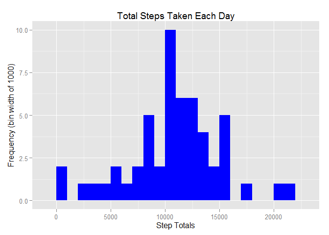

# Reproducible Research: Peer Assessment 1


## Loading and preprocessing the data
### 1. Load the data
Read the zipped activity data set from the current working directory.

```r
activity.df <- read.csv(unz("./activity.zip","activity.csv"))
```
### 2. Process/transform the data into a format suitable for analysis
Convert the date column from a factor to a R date value.

```r
activity.df$date <- as.Date(activity.df$date)
```
Show data characteristics.

```r
str(activity.df)
```

```
## 'data.frame':	17568 obs. of  3 variables:
##  $ steps   : int  NA NA NA NA NA NA NA NA NA NA ...
##  $ date    : Date, format: "2012-10-01" "2012-10-01" ...
##  $ interval: int  0 5 10 15 20 25 30 35 40 45 ...
```

```r
head(activity.df)
```

```
##   steps       date interval
## 1    NA 2012-10-01        0
## 2    NA 2012-10-01        5
## 3    NA 2012-10-01       10
## 4    NA 2012-10-01       15
## 5    NA 2012-10-01       20
## 6    NA 2012-10-01       25
```


## What is mean total number of steps taken per day?
### 1. Calculate the total number of steps taken per day
Note: Days with only NA values are not included in this aggregation.

```r
daily_steps.df <- aggregate(steps ~ date, activity.df, sum)
head(daily_steps.df)
```

```
##         date steps
## 1 2012-10-02   126
## 2 2012-10-03 11352
## 3 2012-10-04 12116
## 4 2012-10-05 13294
## 5 2012-10-06 15420
## 6 2012-10-07 11015
```
### 2. Make a histogram of the total number of steps taken each day

```r
library(ggplot2)
```

```
## Warning: package 'ggplot2' was built under R version 3.2.2
```

```r
qplot(daily_steps.df$steps, geom="histogram", binwidth=1000,
      main = "Total Steps Taken Each Day",
      xlab = "Step Totals", ylab = "Frequency (bin width of 1000)",
      fill = I("blue"))
```

 
#

```

## What is the average daily activity pattern?


## Imputing missing values


## Are there differences in activity patterns between weekdays and weekends?
