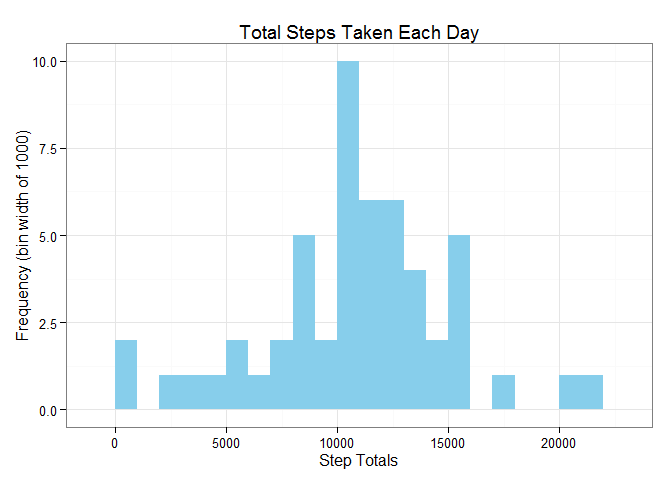

# Reproducible Research: Peer Assessment 1


## Loading and preprocessing the data
### 1. Load the data
Read the zipped activity data set from the current working directory.

```r
activity.df <- read.csv(unz("./activity.zip","activity.csv"))
```
### 2. Process/transform the data into a format suitable for analysis
Convert the date column from a factor to a R date value.

```r
activity.df$date <- as.Date(activity.df$date)
```
Show data characteristics.

```r
str(activity.df)
```

```
## 'data.frame':	17568 obs. of  3 variables:
##  $ steps   : int  NA NA NA NA NA NA NA NA NA NA ...
##  $ date    : Date, format: "2012-10-01" "2012-10-01" ...
##  $ interval: int  0 5 10 15 20 25 30 35 40 45 ...
```

```r
head(activity.df)
```

```
##   steps       date interval
## 1    NA 2012-10-01        0
## 2    NA 2012-10-01        5
## 3    NA 2012-10-01       10
## 4    NA 2012-10-01       15
## 5    NA 2012-10-01       20
## 6    NA 2012-10-01       25
```


## What is mean total number of steps taken per day?
### 1. Calculate the total number of steps taken per day
Note: Days with only NA values are not included in this aggregation.

```r
daily_steps.df <- aggregate(steps ~ date, activity.df, sum)
head(daily_steps.df)
```

```
##         date steps
## 1 2012-10-02   126
## 2 2012-10-03 11352
## 3 2012-10-04 12116
## 4 2012-10-05 13294
## 5 2012-10-06 15420
## 6 2012-10-07 11015
```
### 2. Make a histogram of the total number of steps taken each day

```r
library(ggplot2)
```

```
## Warning: package 'ggplot2' was built under R version 3.2.2
```

```r
qplot(daily_steps.df$steps, geom="histogram", binwidth=1000,
      main = "Total Steps Taken Each Day",
      xlab = "Step Totals", ylab = "Frequency (bin width of 1000)",
      fill = I("sky blue"))+theme_bw()
```

 

### 3. Calculate and report the mean and median of the total number of steps taken per day

```r
paste("The mean total number of steps take per day is:", round(mean(daily_steps.df$steps),2))
```

```
## [1] "The mean total number of steps take per day is: 10766.19"
```

```r
paste("The median total number of steps taken per day is:", median(daily_steps.df$steps))
```

```
## [1] "The median total number of steps taken per day is: 10765"
```

## What is the average daily activity pattern?
### 1. Make a time series plot of the 5-minute interval (x-axis) and the average number of steps taken, averaged across all days (y-axis)
Calculate the average number of steps taken for each interval.  
Note: NA values are note included in this aggregation.

```r
interval_steps.df <- aggregate(steps ~ interval, activity.df, mean)
head(interval_steps.df)
```

```
##   interval     steps
## 1        0 1.7169811
## 2        5 0.3396226
## 3       10 0.1320755
## 4       15 0.1509434
## 5       20 0.0754717
## 6       25 2.0943396
```
Create a line plot showing the average steps for each time interval.

```r
qplot(interval_steps.df$interval,interval_steps.df$steps, geom="line", 
      main = "Average Daily Steps Taken by 5-Minute Interval",
      xlab = "5 Minute Interval", ylab = "Average Number of Steps",
      color=I("sky blue"), size=I(1))+theme_bw()
```

 

### 2. Which 5-minute interval, on average across all the days in the dataset, contains the maximum number of steps?

```r
paste("Interval", 
      interval_steps.df[interval_steps.df$steps==max(interval_steps.df$steps),1],
      "has the maximum number of steps acros all the days in the dataset.")
```

```
## [1] "Interval 835 has the maximum number of steps acros all the days in the dataset."
```

```r
paste("The number of steps in this interval is:",round(max(interval_steps.df$steps)))
```

```
## [1] "The number of steps in this interval is: 206"
```


## Imputing missing values
### 1. Calculate and report the total number of missing values in the dataset

```r
paste("The number of missing step values in the dataset is:", 
     sum(is.na(activity.df$steps)))
```

```
## [1] "The number of missing step values in the dataset is: 2304"
```

### 2. Fill in all of the missing step values in the dataset by using the interval mean step values
Merge the daily activity data and the mean interval data.  This will result in the mean step value for each interval being on each observation.

```r
activity.df <- merge(activity.df, interval_steps.df, by = "interval", suffixes = c("", 
    ".mean"))
head(activity.df)
```

```
##   interval steps       date steps.mean
## 1        0    NA 2012-10-01   1.716981
## 2        0     0 2012-11-23   1.716981
## 3        0     0 2012-10-28   1.716981
## 4        0     0 2012-11-06   1.716981
## 5        0     0 2012-11-24   1.716981
## 6        0     0 2012-11-15   1.716981
```
### 3. Create a new dataset that is equal to the original dataset but with the missing data filled in.

```r
steps_na <- is.na(activity.df$steps)
activity.df$steps[steps_na] <- activity.df$steps.mean[steps_na]
head(activity.df)
```

```
##   interval    steps       date steps.mean
## 1        0 1.716981 2012-10-01   1.716981
## 2        0 0.000000 2012-11-23   1.716981
## 3        0 0.000000 2012-10-28   1.716981
## 4        0 0.000000 2012-11-06   1.716981
## 5        0 0.000000 2012-11-24   1.716981
## 6        0 0.000000 2012-11-15   1.716981
```
### 4. Using the data set with imputed values, make a histogram of the total number of steps taken each day and calculate and report the mean and median total number of steps taken per day.
Histogram 

```r
daily_steps.df <- aggregate(steps ~ date, activity.df, sum)
qplot(daily_steps.df$steps, geom="histogram", binwidth=1000,
      main = "Total Steps Taken Each Day",
      xlab = "Step Totals", ylab = "Frequency (bin width of 1000)",
      fill = I("sky blue"))+theme_bw()
```

 

Calculate Mean and Median

```r
paste("The mean total number of steps take per day is:", round(mean(daily_steps.df$steps),2))
```

```
## [1] "The mean total number of steps take per day is: 10766.19"
```

```r
paste("The median total number of steps taken per day is:", median(daily_steps.df$steps))
```

```
## [1] "The median total number of steps taken per day is: 10766.1886792453"
```
Imputing the missing step values changed the histogram by increasing the frequency for the step totals. For example the frequency of the 10,000 to 11,000 bin was at 10 before imputing the values and now is over 15.

Imputing the missing step values didn't change the mean, but the median did show a small change.

## Are there differences in activity patterns between weekdays and weekends?
### 1. Create a new factor variable in the dataset with two levels - "weekday" and "weekend" indicating whether a given date is a weekday or weekend day.

```r
activity.df$day_category <-  as.factor(
  ifelse(weekdays(activity.df$date)=='Saturday'|
           weekdays(activity.df$date)=='Sunday',
        'Weekend','Weekday'))
str(activity.df)
```

```
## 'data.frame':	17568 obs. of  5 variables:
##  $ interval    : int  0 0 0 0 0 0 0 0 0 0 ...
##  $ steps       : num  1.72 0 0 0 0 ...
##  $ date        : Date, format: "2012-10-01" "2012-11-23" ...
##  $ steps.mean  : num  1.72 1.72 1.72 1.72 1.72 ...
##  $ day_category: Factor w/ 2 levels "Weekday","Weekend": 1 1 2 1 2 1 2 1 1 2 ...
```
### 2. Make a panel plot containing a time series plot of the 5-minute interval (x-axis) and the average number of steps taken, averaged across all weekday days or weekend days (y-axis).

```r
interval_steps.day_category.df <- aggregate(steps ~ interval + day_category,              activity.df, mean)

ggplot(interval_steps.day_category.df, aes(x=interval, y=steps)) + 
        geom_line(color=I("sky blue")) + 
        facet_wrap(~ day_category, nrow=2, ncol=1) +
        labs(x="5 Minute Interval", y="Average Number of Steps") +
        theme_bw()
```

 
